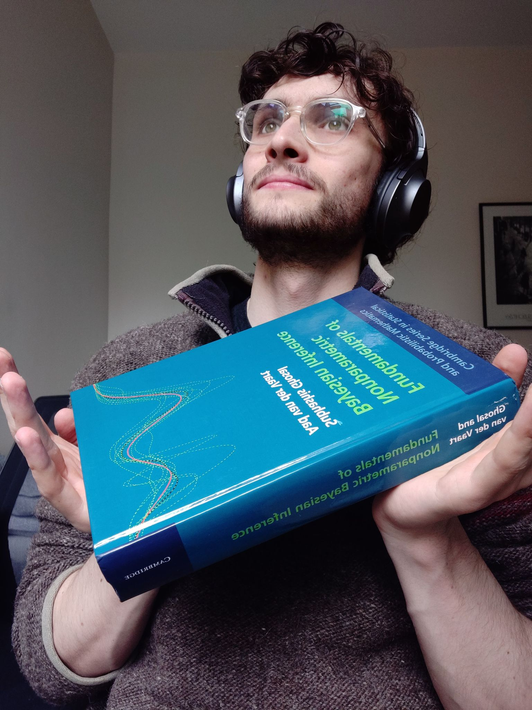

```{r echo=FALSE, message=FALSE, warning=FALSE}
library(tidyverse)
library(ggtern)

whitesmoke <- "#F5F5F5"
lightgrey <- "#D3D3D3"
lightgold <- "#E69F00"

lightblue <- "#56B4E9"
lightgreen <- "#009E73"
lightpink <- "#CC79A7"

midblue <- "#3D9BD0"
midgreen <- "#00855A"
midpink <- "#B3608E"

darkblue <- "#004E83"
darkgreen <- "#00380D"
darkpink <- "#802D5B"

cbpalette <- c("#E69F00","#56B4E9","#009E73", "#F0E442","#0072B2","#D55E00","#CC79A7", "#999999")
```

# Refresher on parametric statistics

## Parametric Bayesian approach

* Statistical model $\{p_\theta : \theta \in \Theta\}$
  * Expresses beliefs about how the data $y$ is generated
* Flexibility in the model controlled by a finite dimensional parameter $\theta \in \Theta$
* Place prior $p(\theta)$ -- lots of ways to do this!
  * *Informative* if $\theta$ has a clear interpretation, you are a scientist who knows something it or there exists literature studying it then you should use that information!
  * *Non-informative* when $\theta$ is less interpretable, little to no genuine prior information or you want to avoid adding subjectivity to the analysis
* Posterior $p(\theta \, | \, y) \propto p(y \, | \, \theta) p(\theta)$

## Example: Poisson Gamma conjugate

* Poisson model with Gamma prior on the rate parameter $\lambda > 0$
\begin{alignat*}{2}
&\text{(\textit{Prior})}       &         \lambda &\sim \text{Gamma}(a, b), \\
&\text{(\textit{Likelihood})}  & \qquad      y_i &\sim \text{Pois}(\lambda), \quad i = 1, \ldots, n.
\end{alignat*}
* Conjugate prior, such that posterior is 
$$
p(\lambda \, | \, y_1, \ldots, y_n) \propto \text{Gamma}(a + \sum_{i = 1}^n y_i, b + n).
$$

##

```{r echo=FALSE, fig.height = 3.5}
x <- c(1, 1, 2, 4, 1, 4) # Simulated from lambda 2
y <- c(0, 0.05, 0, 0, 0.1, 0.05)

df <- data.frame(x, y)

ggplot(data = data.frame(x = c(0, 10)), aes(x)) +
  stat_function(fun = dgamma, n = 201, args = list(shape = 16, rate = 7), aes(col = "1")) +
  stat_function(fun = dgamma, n = 201, args = list(shape = 3, rate = 1), aes(col = "2")) +
  geom_point(data = df, aes(x = x, y = y), shape = 21) +
  scale_x_continuous(breaks = c(0, 5, 10)) +
  labs(x = expression(lambda), y = expression(p(lambda))) +
  geom_vline(xintercept = 2, colour="grey20", linetype = "longdash") +
  scale_color_manual(values = c(midblue, midgreen),
                     name = "",
                     labels = c("Posterior", "Prior")) +
  theme(panel.background = element_blank(),
        legend.justification = c(0, 0),
        legend.position = c(0.75, 0.6),
        axis.line = element_line(colour = "grey"))
```

## The posterior

* Once you have the posterior everything is simple!
  * Marginal posteriors for $\theta_k$ are $\int p(\theta \, | \, y) \text{d} \theta_{-k}$
  * Point estimates $\hat \theta$ like the mean or mode
  * $100(1 - \alpha)\%$-credible set $\mathcal{C} \subseteq \Theta$ such that $\int_\mathcal{C} p(\theta \, | \, y) \text{d} \theta = 1 - \alpha$
* But obtaining the posterior is usually not easy
  * Approximate Bayesian inference methods like MCMC, INLA, VB

## Parametric Bernstein-von Mises

* Frequentist properties of Bayesian methods i.e. imagine that we repeat "the experiment" of doing Bayesian inference with different data each time
* Bernstein-von Mises theorem: under some conditions, the posterior looks asymptotically like the a Normal centered at $\theta_0$ (the true value) with covariance matrix $\frac{1}{n} I^{-1}(\theta)$
* Sometimes used to say that, eventually with enough data, the influence of the prior "washes out", so long as it has support for the true value
* Not all the helpful for applied statisticians!
  * Our models are misspecified
  * The data are biased
  * We're never getting anywhere near infinite amounts of data
  * One from [Dan Simpson](https://statmodeling.stat.columbia.edu/2017/11/27/asymptotically-we-are-all-dead/): "The assumptions of the Bernstein-von Mises theorem are fragile and it’s very easy for a dataset or analysis to violate them. It is very hard to tell, without outside information, that this has not happened."

# Non-parametric statistics

## What is it?

* $\theta \in \Theta$ is now infinite dimensional!
  * A bit confusing to call something "non-parametric" when that means "infinite parameters", but we're stuck with it now
* Which things are infinite dimensional?
  * Functions (a function can be thought of as an infinite dimensional vector)
  * Probability densities (rather than choosing a prior, what if I just put a prior on my prior, extending the hierarchical model further)
  * When the number of parameters grows with the amount of data (it makes sense that if you have more data then you can afford to be more flexible in modelling it)

## Why would you want to do that?

1. *Flexibility* Parametric models can be quite restrictive
    * Though you can add parameters to make your parametric model more flexible e.g. Tim's [Distributional Sinh-arcsinh Regression](https://github.com/twolock/distreg-illustration)
2. *Representation of uncertainty* Similar to above, but parametric assumptions can overstate your certainty
    * For example, if I assert something is linear then I could falsely extrapolate that assumption out and misrepresent uncertainty
    * That said, what about doing more sensible parametric modeling (I think the claim would be that it's not possible)

## Some challenges

From the introduction of @ghosal2017fundamentals:

1. *Prior choice* And you thought it was difficult to pick priors on finite parameters?
    * "...overall agreement that subjective specification of a prior cannot be expected in complex statistical problems" $\implies$ "non-informative" or "default prior" setting
2. *Computation* Can't do simulation on a finite dimensional object in practise
3. *Asymptotic behaviour* Don't even have Bernstein-von-Mises
    * The influence of the prior doesn't wash out, even with infinite data (and following 1. it's hard to pick a reasonable prior!)

# Example: the Dirichlet process

## Motivation

::: columns

:::: column

* "fundamental importance" in Bayesian nonparametrics according to @ghosal2017fundamentals
* Default prior on probability measures
* Each draw from a Dirichlet process (DP) is a probability distribution

::::

:::: column

```{r pressure, echo=FALSE, fig.cap="It was a lot colder the other week", out.width = '60%'}

```

::::

:::

## Beta distribution

* A  is an infinite dimensional generalisation of the Dirichlet distribution
* ... and a Dirichlet distribution is a multivariate generalisation of the Beta distribution
* Let $w_1 \in [0, 1]$, then the Beta distribution is
$$
p(w_1; \alpha, \beta) = \frac{\Gamma(\alpha + \beta)}{\Gamma(\alpha) \Gamma(\beta)} w_1^{\alpha - 1} w_1^{\beta - 1}
$$
* It's often good as a prior on a probability
* Conjugate prior for Bernoulli random variables

##

Here are some examples of what it looks like:

$\alpha = \beta = 0.1$

```{r echo=FALSE}
ggplot(data = data.frame(x = c(0, 1)), aes(x)) +
  stat_function(fun = dbeta, n = 101, args = list(0.1, 0.1), col = midblue) +
  labs(x = expression(w[1]), y = expression(p(w[1]))) +
  theme(axis.line = element_line(colour = "grey"))
```

##

$\alpha = \beta = 100$

```{r echo=FALSE}
ggplot(data = data.frame(x = c(0, 1)), aes(x)) +
  stat_function(fun = dbeta, n = 101, args = list(100, 100), col = midgreen) +
  labs(x = expression(w[1]), y = expression(p(w[1]))) +
  theme(axis.line = element_line(colour = "grey"))
```

##

* $\alpha = 1, \beta = 10$

```{r echo=FALSE}
ggplot(data = data.frame(x = c(0, 1)), aes(x)) +
  stat_function(fun = dbeta, n = 101, args = list(1, 10), col = midpink) +
  labs(x = expression(w[1]), y = expression(p(w[1]))) +
  theme(axis.line = element_line(colour = "grey"))
```

## Example of use in HIV models: BYM2

* Want to put a prior on the proportion $\pi \in [0, 1]$ of variance which is spatially structured for a spatial random effect?
$$\bphi = \sqrt{\frac{1}{\tau_\phi}} \left(\sqrt{\pi} \bu + \sqrt{1 - \pi} \bv \right)$$
* Beta distribution $\pi \sim \text{Beta}(a, b)$ seems decent choice

## Dirichlet distribution

* What if I have probabilities $w = (w_1, \ldots, w_K)$ with $w_k > 0$ and $\sum_k w_k = 1$ instead of just $w_1$ (and $1 - w_1 = w_2$)?
* $w \sim \text{Dirichlet}(\alpha_1, \ldots, \alpha_K)$ if
$$
p(w; \alpha) = \frac{\Gamma(\sum_k \alpha_k)}{\prod_k \Gamma(\alpha_k)} w_1^{\alpha_1 - 1} w_2^{\alpha_2 - 1} \times \cdots \times w_K^{\alpha_K - 1}
$$
* It's conjugate for multinomial random variables $(n_1, \ldots, n_K) \sim \text{Multinomial}(n, w)$ with $n = \sum_k n_k$ then
$$
p(w \, | \, n_1, \ldots, n_K) \propto \text{Dirichlet}(\alpha_1 + n_1, \ldots, \alpha_K + n_k).
$$

##

Here is approximately what that looks like for $w = (w_1, w_2, w_3)$ and:

$\alpha = (50, 50, 50)$

```{r, echo=FALSE, message=FALSE, warning=FALSE}
plot_3d_dirichlet <- function(n = 10000, alpha) {
  x <- gtools::rdirichlet(n = n, alpha = alpha)

  x %>%
    as.data.frame() %>%
    ggtern::ggtern(aes(x = V1, y = V2, z = V3)) + 
    geom_point(alpha = 0.2, color = lightgrey, size = .5) + 
    stat_density_tern(geom = 'polygon', aes(fill = ..level.., alpha = ..level..)) +
    guides(fill = FALSE, alpha = FALSE) +
    scale_fill_viridis_c()
}

plot_3d_dirichlet(alpha = c(50, 50, 50))
```

##

$\alpha = (1, 1, 1)$

Note: for some reason the density geom isn't working well here, so I'm plotting random draws in grey to give an idea.

```{r, echo=FALSE, message=FALSE, warning=FALSE}
plot_3d_dirichlet(alpha = c(1, 1, 1))
```

##

$\alpha = (0.25, 0.25, 0.25)$

```{r, echo=FALSE, message=FALSE, warning=FALSE}
plot_3d_dirichlet(alpha = c(0.25, 0.25, 0.25))
```

## Example of use in HIV models: risk groups

* Multinomial model (one of ordinal logistic regression, baseline-cateogry logistic regression, nested logistic regression)
* Four outcome categories each with probability $w_k$
  * $k = 1$: *not sexually active*
  * $k = 2$: *one cohabiting partner*
  * $k = 3$: *non-regular sexual partners*
  * $k = 4$: *key populations*
* Dirichlet prior $(w_{1}, w_{2}, w_{3}, w_{4}) \sim \text{Dirichlet}(\alpha_1, \ldots, \alpha_4)$

## Finite Dirichlet process

* Currently we have a prior on probability distributions over $1, \ldots, K$
* What about instead drawing a parameter $\theta_k^\star \sim H$ instead?
  * $H$ is referred to as a "base measure", you can think of it like being the mean
* So the procedure to get $G$ is
  1. Sample $\theta_k^\star \sim H$ for $k = 1, \ldots, K$
  2. Sample $w \sim \text{Dirichlet}(\alpha / K)$
  3. Set $G = \sum_k w_k \delta_{\theta_k^\star}$

```{r eval=FALSE}
K <- 4 # Fix K
theta <- rnorm(n = K, 0, 1) # Gaussian base measure H

# Weights from the Dirichlet
alpha <- 4 # Fix alpha
w <- gtools::rdirichlet(n = 1, alpha = rep(alpha, K) / K)
```

##

Draws from this random discrete probability measure look like:

```{r, echo=FALSE}
finite_dirichlet <- function(K = 4, alpha = 4) {
  theta <- rnorm(n = K, 0, 1) # Gaussian base measure H
  w <- gtools::rdirichlet(n = 1, alpha = rep(alpha, K) / K) # Weights from the Dirichlet
  discrete_measure <- data.frame(theta = theta, w = t(w))

  ggplot(discrete_measure, aes(x = theta, y = w)) +
    geom_point() +
    geom_segment(aes(xend = theta), yend = 0)
}

cowplot::plot_grid(
  finite_dirichlet(),
  finite_dirichlet(),
  finite_dirichlet(),
  finite_dirichlet(),
  ncol = 2
)
```

## Finite mixture model

* You can use the finite DP as a way to think about mixture models
* What if we had data $y_{1:n}$ related to e.g. four risk groups
* Sample $G$ from the finite DP, then sample from $\theta_{1:n} \sim G$ to get the risk group specific parameters
* Then $y_i \sim F_{\theta_i}$ for each data point $y_i$

##

::: columns

:::: column

```{r echo=FALSE}
finite_dirichlet()
```

::::

:::: column

* Sample $\theta_i \sim G$
* Then e.g. $y_i \sim \text{Poisson}(\theta_i)$

::::

:::

## Dirichlet process

* $G \sim \text{DP}(\alpha, H)$ if for all partitions $A_1, \ldots, A_r$ of the sample space $\Omega$ then
$$G(A_1), \ldots, G(A_r) \sim \text{Dirichlet}(\alpha H(A_1), \ldots, \alpha H(A_r))$$
* i.e. marginals on finite partitions have a Dirichlet distribution
* The single parameter $\alpha \in \mathbb{R}$ is like a precision
* Taking the limit $K \to \infty$ of the finite Dirichlet process obtains the Dirichlet process
$$G = \sum_{k = 1}^\infty w_k \delta_{\theta_k^\star}$$
  * The number of unique $\theta_k^\star$ grows at a logarithmic rate (this is confusing to me, unless draws from the Dirichlet distribution are sparse somehow, but it becomes clearer looking at the alternative ways to see the DP)

## Lots of alternative ways to see the Dirichlet process!

* Including
  * Chinese restaurant process
  * Stick-breaking construction
  * Pólya urn scheme
* Understanding these makes seeing different properties more intuitive

# Thanks!

## References {.allowframebreaks}
